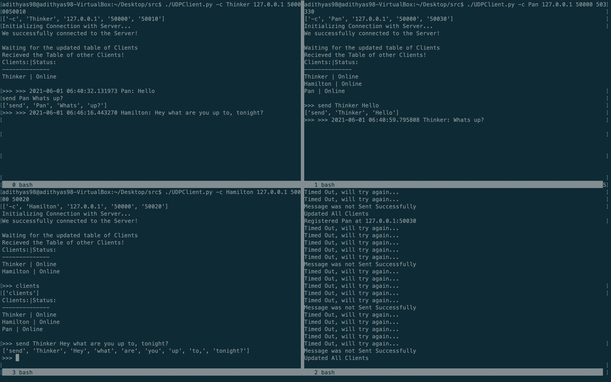

# Introduction

A Simple Command Line Chat Application built on the UDP protocol 

 

## Usage 

To use the application, please run the UDPClient.py file with the following commands based on if you are trying to start a Server or if you are trying to start a Client.  

| User Type | Command                                                         |
| --------- | --------------------------------------------------------------- |
| Server    | -s \<Port\>                                                     |
| Client    | -c \<nick-name\> \<server-IP\> \<server-Port\> \<client-port\>  |

Please note that this is in conjunction with actually calling the UDPClient.py.For example starting up the Server would look like the following 

 ./UDPClient.py -s 50000 
 

### A note about Port numbers 
A user must ensure that you are using a PORT number that isn't already being used for some other process, already allocated, or otherwise restricted for use by the Operating System. Through some research it seems that Dynamic Ports exist in the range 49152 to 65535[^1].

[^1]: https://www.webopedia.com/reference/well-known-tcp-port-numbers/ 

### Commands for the Server 

There are no commands for the Server after it has been initialized 

### Commands for the Client 

There are a few commands for the Client once the "\>\>\>" prompt shows up after all connections between the Client and the Server have been initialized and a client table has been transferred. 

| Command                   | Description                                                                                      |
|---------------------------|--------------------------------------------------------------------------------------------------|
| clients                   | This will reprint an updated client table that can be used to contact other users on the service |
| send \<nick\> \<message\> | This will send the message to the Specified user.                                                |
| dereg                     | This will de register the user (set the client to offline in the server's records                 |

# The Code Explained 

Here I will attempt to explain the most important functions in each of the classes used for this application. I have tried my best to include as much documentation as possible within my code to make is as easy as possible for anyone to follow along, so this will primarily serve as a broad over of the functions and methods used.  

## UDPSocket Class 

This class handles all of the communication for both the Server and the Client classes. The primary methods include send,receive,secureSend, and finally secureRecieve. The send and [receive](receive) modules simply use python's built in Socket library to communicate to IP Addresses and PORT numbers specified by the process calling it. The secureReceive and secureSend methods add a bit more to the bare bones send and receive methods such as adding a checksum, formatting a packet correctly, and implementing a simple stop-and-wait algorithm to ensure that the data is sent correctly. The timeout for these methods is 0.5s as specified by the assignment and the method will try 5 times before giving up, again as specified by the assignment.  

The secureSend message sends the specified data included as an input parameter to the IP and PORT specified. The objective of creating such a method was to allow for the abstraction of the low level communication that occurs in through the use of a UDP socket. The biggest barriers that I faced along the way were in how I implemented the basic stop and wait protocol, being able to time things correctly, and finally how I handled the Checksum. 

The checksum I handled using a MD5 hash function that would take a byte stream of the data being sent and creating a MD5 hash that was then sent along with the packet (a list). The receiver would then be able to verify the hash and send an ACK packet to acknowledge that the packet sent has been received correctly.

As mentioned before the secureRecieve method is used to [receive](receive) data and uses the same protocol used in the secureSend method. This proved to be one of the most challenging to actually configure and ensure that it worked correctly. However, after some unit testing, I was able to resolve all the errors and check to make sure data was being received and transmitted correctly.

### secureSend Method

Here is the code for the secureSend method as described above.

~~~
def secureSend(self,MSG,PORT,IP='127.0.0.1'):
        """
        This method will securely send data using the simple Stop and Wait
        Algorithm and a Checksum to ensure the Integrity of the MSG

        Parameters:
            MSG: Is a list of length 3 with the following data in the
                Respective Index
                    Oth - Sequence Number of the Current Packet
                    1st - The Command
                    2nd - Message/Data to send

        What will be sent:
            A checksum will be sent prior to sending the message
            A serialized list with the following information in its indices
                Oth - Sequence Number of the Current Packet
                1st - The Command
                2nd - Message/Data to send
                3rd - Checksum Hash
        Output:
            200 - if the Message was sent successfully
            100 - if the Message was not sent Successfully
        """
        #We need to first pickle the message
        Data = pickle.dumps(MSG[2])
        #Calculate the Hash
        checksum = md5(Data).hexdigest()
        MSG.append(checksum)
        self.send(MSG,PORT,IP)
        #We now need to start a timeout counter
        for i in range(5):
            try:
                ACK,_ = self.recieve()
                if ACK == 'ACK':
                    #Everything went well so we want to return 200
                    return 200
            except socket.timeout as e:
                print("Timed Out, will try again...")
                self.send(MSG,PORT,IP)
        #We tried multiple times and it failed
        print("Message was not Sent Successfully")
        return 100
~~~

### secureRecieve Method
This is the secureRecieve method as described above.

~~~
    def secureRecieve(self):
        """
        This method is meant to recieve data from a host securely in
        accordance with the secureSend() method. If the data is recieved
        correctly, the method will send an ACK back. If the data is not 
        recieved correctly, the method will simply disregard the message

        Output:
            100 -  if the data as not recieved correctly
            The data -  if the data was recieved correctly
        """
        #We want to continuously check for packets until we recieve one
        while True:
            try:
                #recieve the Data
                rdata,Address = self.recieve()
                if rdata != None:
                    break
            except socket.timeout as e:
                continue

        #Now we can check the checksum
        dataToCheck = pickle.dumps(rdata[2])
        checksum = md5(dataToCheck).hexdigest()
        if len(rdata) >= 4:
            if checksum == rdata[3]:
                #Everything checks out!
                #we need to send an ACK
                #The Address Tuple is of the form (IP,PORT)
                self.send('ACK',Address[1],Address[0])
                #now we can return the Message to be processed
                return rdata[0:-1],Address
~~~

## Client 

This will handle all the functionality that the client needs to handle as described in the assignment description. The commands for the Client are mentioned above in the introduction to the project. The functionality is handled using multithreading and a main loop that the client will enter once it has registered with the Server and has received an updated list of the Clients available. 

There are two main loops that the client will have to use multithreading to handle any communications from other Clients or from the Server and allow the user to input commands (as described above). 

### MainLoop Method

The Main loop handles all incoming UDP socket communication by creating a new thread with the processMessage method as the target. 

~~~
    def MainLoop(self):
        """
        This will serve as the main loop that the Client will use to listen
        for user input
        """
        #we want to make a thread to listen for user input
        y=th(target=self.processInput,daemon=True)
        y.start()
        self.threads.append(y)
        while True:
            #We will use this as out main loop to listen for inputs
            try:
                data,address = self.udp.secureRecieve()
            except TypeError:
                continue
            if data != None:
                x=th(target=self.processMessage,args=(data,address),daemon=True)
                x.start()
                self.threads.append(x)
                data = None
                address = None
        return None

~~~

### processMessage Method

The processMessage method looks into the packet and deciphers what is the type of message being displayed and then calls a helper function to process that message correctly. 

~~~
    def processMessage(self,data,address):
        command = data[1].split(':')
        data = data[2]
        if command[0] == 'update':
            #This will update our table
            self.clientTable = data
        elif command[0] == 'MSG':
            #We just recieved a message
            #we just want to print the message
            if address[1] == self.serverPort:
                print(">>> You Have Messages")
            print('>>> {} {}'.format(datetime.now(),data))
        else:
            print('>>> Incorect Command. Please Try Again')
 
~~~

### processInput Method
The processInput method works in a similar way. In the MainLoop method the processInput method is called in a separate thread so that it can run in the background and allow for multiple processes to happen at the same time. The method then waits for the user to input a command, deciphers the actual command used by the user and processes that data by calling helper functions that are included in Client class. This configuration allows the client to handle multiple incoming connections as well as handle user input at the same time.

~~~
    def processInput(self):
        """
        This method will process any inputs that is recieved by the client, 
        from both the Server and other clients. It is split up this way to 
        make it easiet to handle multiple requests
        """
        while True:
            command = input(">>> ").split(' ') 
            print(command)
            if command[0] == 'send':
                #we want to send a message
                nick = command[1]
                data = " ".join(command[2:])#Combine the list into strings
                self.sendMessage(nick,data)
            elif command[0] == 'clients':
                #This will list the clients
                print(self.clientTablePrint())
            elif command[0] == 'dereg':
                #we want to deregister the user
                MSG = [1,'dereg:',self.Nick]
                self.udp.secureSend(MSG,self.serverPort,self.serverIP)
                data,_ = self.udp.secureRecieve()
                if data[2] == 'ACK':
                    print("You're Offline. Bye.")
                    sys.exit()
                else:
                    print("Server Connection Timed Out\n")
                    print("Exiting...")
                    sys.exit()#this will exit the whole program
 
~~~

## Server Class

This class handles all of the actions that the Server will need to take as well as those described in the assignment documentation.

As with the client class, I have elected to use a similar method to processing any incoming messages, registration, and de registration requests. Since the similarities are so great(in fact the names of the methods are the exact same!), I will try to focus on other interesting and critical components of the Server Class. 

### registerUser Method
The first critical component is the is the registerUser class which allows the server to actually register a user in the clientTable dictionary and subsequently send all the data to the clients. I elected to use a dictionary (I learned that the backbone of a python dictionary is in fact a hash table![^2])

[^2]: https://mail.python.org/pipermail/python-list/2000-March/048085.html

~~~
    def registerUser(self,Nick,IP,PORT):
        """
        This method is used to register a user by adding them to the 
        table along with their IP,PORT, and Online Status

        Parameters:
            Nick: The Nickname of the client connecting to the Server
            IP: The IP of the Client
            PORT: The Port of the Client
        """
        #we first want to check if the nickname already exists
        if Nick in self.clientTable:
            if not self.clientTable[Nick]['Online']:
                #this means the client is logging back in
                #if this is the case we want to just update the online status
                self.clientTable[Nick]['Online']=True
                #Now we want to send the updated table to the Client
                self.updateAllClients()
                self.sendStored(Nick)
                return None
            #If the nickname already exists, we dont want to allow it
            print("The Nickname already exist, please exit the program")
            #We want to send this to the client
            MSG = [1,1,"ERROR"]
            self.udp.secureSend(MSG,PORT,IP)
            return None
        #First we will make an empty dictionary to hold the New Client's Data
        client = dict()
        client['IP'] = IP
        client['PORT'] = PORT
        client['Online'] = True
        #Now we need to add the data to the full Client Table
        self.clientTable[Nick] = client
        print("Registered {} at {}:{}".format(Nick,IP,PORT))
        #Now that we have updated the table, we can tell all existing clients
        self.updateAllClients()
        return None

~~~

### storeMessage Method

This method is what is used by the server to store messages sent by a client to a client that is either unreachable or is currently offline. The method also utilizes a dictionary format to store the messages waiting to be sent. This dictionary is then called on by another helper method called sendStored that will then relay all the stored messages to the correct client when they log back in.

The code for this method can be seen

~~~
    def storeMessage(self,nick,MSG,address):
        """
        This method will first try to contact the client and if that fails
        will store the message and relay it to the client when they reregister
        Parameters:
            nick: the nickname of the client being contacted
            MSG: the Message to relay to the client
            address: the address of the client making the request
        """
        #first we will get all the clients details
        IP = self.clientTable[nick]['IP']
        PORT = self.clientTable[nick]['PORT']
        online = self.clientTable[nick]['Online']
        #first we will check to see if the client is online in our records
        if online:
            #If they are online, we want to try to send the message to them
            response = self.udp.secureSend(MSG,PORT,IP)
            if response == 200:
                #Then the client was online!
                #we want to notify the client
                Error = [1,"ERROR",'The client is online!']
                self.udp.secureSend(Error,PORT,IP)
                return None
            else:
                #We want to update the Status of the Client
                self.clientTable[nick]['Online'] = False
                #The message was not send correctly, so we want to store it
                if nick in self.messages:
                    #if there is a key then we wna to append a message
                    self.messages[nick].append(MSG)
                else:
                    #if a key doesn't already exist we want to make on
                    self.messages[nick] = [MSG]
                return None
        else:
            #If the client is not online we, want to store the message
            #The message was not send correctly, so we want to store it
            if nick in self.messages.keys():
                #if there is a key then we wna to append a message
                self.messages[nick].append(MSG)
            else:
                #if a key doesn't already exist we want to make on
                self.messages[nick] = [MSG]
            return None

~~~

### updateAllClients Method

This method will send all clients currently connected and online a packet containing a dictionary of the Clients, their IP Address, and Port Number. Note that the IP and Port information is not displayed to the user in an effort to unclutter the display.

The Code for the following can be seen here

~~~
    def updateAllClients(self):
        """
        This method will update all clients in the clientTable dictionary. The
        secureSend method of the UDPSocket class will be utilized to send the 
        dictionary file. 
        """
        #We will create a base message as described in the secureSend method
        #A packer is of the form
        #[Current Seq,Total Packets,Message]
        MSG = [1,'update:',self.clientTable]
        for client,clientData in self.clientTable.items():
            #Now we can send the packet with the secure send method
            PORT = clientData['PORT']
            IP = clientData['IP']
            if clientData['Online'] == True:
                #we only want to send the updated table to the clients online
                response = self.udp.secureSend(MSG,PORT,IP)
                
                
        #we updated all the clients so we can print it to the console
        print("Updated All Clients")
        return None
 

~~~

## Other Methods

In an effort to conserve time of both myself and the reader I have decided to only include what I find to be the most critical ,and frankly interesting, methods in this write up, so please refer to the actual code for more information on other methods not included in this write up. I have tried my best to document as much as possible as I went a long to make it as easy as possible to understand my thought process behind how I designed each of these methods.
